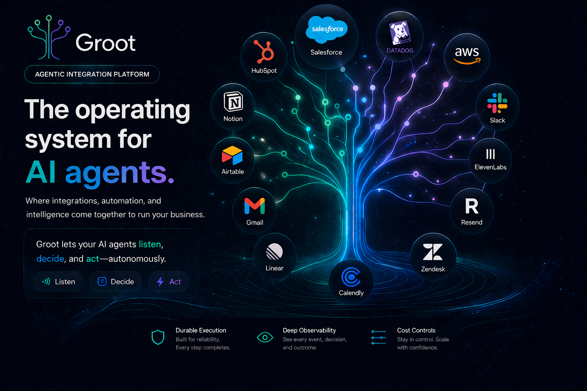

# Groot (Community Edition)




Groot (Community Edition) is the self-hosted, single-tenant edition of Groot.

Groot is an Agentic Integration Platform that lets you build, deploy, and
orchestrate AI agents across your entire business.

It connects your apps, data, and workflows through a real-time event
stream, while giving agents the ability to listen, decide, and act
autonomously. With durable execution, deep observability, and built-in cost
controls, Groot ensures every agent-driven process runs reliably at scale.

In short: Groot is the operating system for AI agents, where integrations,
automation, and intelligence come together to run your business.

## Quick Start

Requirements:

- Docker
- Docker Compose
- a supported host architecture:
  - Apple Silicon or other `arm64` / `aarch64` hosts
  - `x86_64` hosts
- a public HTTPS URL for the Groot API if external systems need to send events
  into Groot

From this directory:

```sh
./setup-community.sh
source ~/.zshrc
groot start
```

If you are using Bash, reload `~/.bashrc` or `~/.bash_profile` instead.

The first run may take a few minutes because Docker may need to download the
images.

Endpoints:

- UI: `http://localhost:3000`
- API: `http://localhost:8080`

## Before You Run Setup

`./setup-community.sh` will ask for `GROOT_PUBLIC_BASE_URL`.

Use the public API URL that external systems should call when sending events to
Groot. Typical options are:

- a reverse tunnel for local testing, such as ngrok or Cloudflare Tunnel
- a public HTTPS reverse proxy or ingress in a longer-lived deployment

Examples:

```text
https://abc123.ngrok.app
https://groot-api.example.com
```

This value is used to generate the ingest endpoint shown in `Settings -> General`.

## What The Setup Does

`./setup-community.sh`:

- creates `.env` from `.env.example` if needed
- asks for the minimum required settings
- generates internal secrets
- optionally stores AI provider credentials
- detects your host architecture and installs the matching shipped first-party
  plugin archive into the active runtime paths
- adds this bundle directory to your shell `PATH`
- exports `GROOT_HOME` so plugin build commands can target this bundle later
- starts Postgres
- applies the bundled pending database migrations from the canonical baseline
- leaves Groot ready to start with the browser UI as the main entry point

After setup, use the `groot` command directly.

## Commands

- `groot setup` updates `.env` and reruns the guided setup flow
- `groot start` starts the full Community stack
- `groot stop` stops and removes the stack containers
- `groot restart` restarts the stack
- `groot status` shows current container status
- `groot logs` tails logs for the whole stack or one service
- `groot migrate` applies only pending bundled SQL migrations
- `groot integration init` scaffolds a standalone integration plugin repository
- `groot integration build` builds a local plugin repo into this Community bundle
- `groot integration verify` checks shipped and local plugin artifacts for this bundle
- `groot update --check` shows your installed version and the latest Community release
- `groot update` upgrades the bundle to the latest Community release

The bundled migration runner is tracked and pending-only. On an existing local
database created before the baseline reset, the first run records the baseline
instead of replaying legacy SQL.

## Configuration

This bundle uses `.env` for deployment-level configuration.

The most important settings are:

- image references:
  - `GROOT_API_IMAGE`
  - `GROOT_UI_IMAGE`
  - `AGENT_RUNTIME_IMAGE`
  - `AI_GATEWAY_IMAGE`
- runtime settings:
  - `GROOT_PUBLIC_BASE_URL`
  - `COMMUNITY_TENANT_NAME`
  - `GROOT_UI_PORT`
  - `GROOT_HTTP_PORT`
- telemetry settings:
  - `GROOT_INSTALL_ID`
  - `GROOT_TELEMETRY_ENABLED`
  - `GROOT_TELEMETRY_BASE_URL`
- optional AI provider credentials:
  - `OPENAI_API_KEY`
  - `ANTHROPIC_API_KEY`
  - `GROQ_API_KEY`
  - `HF_TOKEN`

Deployment-level AI provider credentials belong in `.env`. Connection-specific
integration secrets do not belong in the basic install flow.

Community telemetry is anonymous and can be disabled by setting:

```env
GROOT_TELEMETRY_ENABLED=false
```

## Plugins

The Community bundle is a runtime host for integration plugins.

- setup installs active runtime plugin artifacts into `integrations/plugins/`
- setup installs active shipped first-party metadata into
  `integrations/first_party_plugins.json`
- the bundle ships architecture-specific first-party plugin archives under:
  - `integrations/archives/linux-amd64/`
  - `integrations/archives/linux-arm64/`
- official first-party integrations are shipped that way too; Resend and Slack
  are the first shipped examples
- those shipped first-party artifacts are required for the Community runtime;
  missing or broken official plugin artifacts now fail fast during startup
- plugin source code should live in its own repository, not inside the
  Community bundle
- `GROOT_HOME` points at this bundle root after setup, so local plugin builds
  can install directly into this runtime
- `groot integration verify` runs the actual `groot-api` plugin verifier inside
  the configured Community API image, so it checks the same Linux/runtime path
  the stack will use at startup
- shipped first-party plugin metadata includes version, publisher, and sha256
  provenance in `integrations/first_party_plugins.json`

If the bundle does not include a shipped first-party archive for your host
architecture, `./setup-community.sh` fails early before runtime startup.

Typical workflow:

```sh
mkdir -p ~/Desktop/Code/my-crm-groot-plugin
cd ~/Desktop/Code/my-crm-groot-plugin
groot integration init my_crm
groot integration build .
groot integration verify

cd "$GROOT_HOME"
groot restart
```

Once the stack restarts, the new integration appears in the catalog like any
other provider. `groot integration build` produces Linux-compatible `.so`
artifacts for the Dockerized Community API runtime, even if you run it from a
non-Linux host. Official shipped first-party plugin artifacts are versioned
alongside the Community release and verified against the bundle metadata before
startup.

For a fuller walkthrough, see [PLUGIN_DEVELOPMENT.md](./PLUGIN_DEVELOPMENT.md).

## Public API URL And Ingest Endpoint

Groot builds its tenant ingest endpoint from `GROOT_PUBLIC_BASE_URL`. In the UI
you can find it under `Settings -> General -> Ingest endpoint`.

Use a value that points at the public API host that accepts `POST /events`, for
example:

```env
GROOT_PUBLIC_BASE_URL=https://groot-api.example.com
```

With that setting, the ingest endpoint shown in Settings becomes:

```text
https://groot-api.example.com/events
```

Important notes:

- do not point `GROOT_PUBLIC_BASE_URL` at the UI host unless that same host
  also proxies `/events` to `groot-api`
- for local webhook testing, a reverse tunnel such as ngrok can expose your
  local API port publicly
- for longer-lived deployments, put the API behind a proper HTTPS reverse proxy
  or ingress such as Caddy, Nginx, Traefik, or a cloud load balancer

## Updating Groot

Use the built-in updater to move to the latest Community release:

```sh
groot update --check
groot update
```

After updating:

- run `groot status`
- review `groot logs`
- sign in and verify the app loads normally
- confirm the ingest endpoint in `Settings -> General` still matches your
  intended public API URL

If you ever need to recover manually after a failed update, restore the
previous Community image references in `.env`, then run:

```sh
groot restart
groot migrate
```
